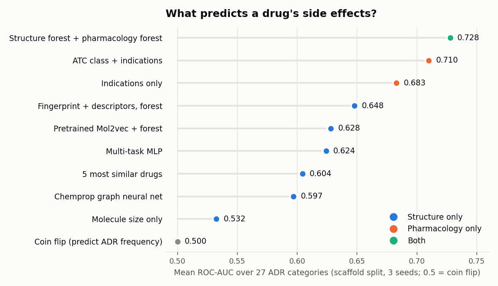

# adverse-drug-reactions

Predicting which of 27 adverse-drug-reaction (ADR) categories a drug causes, from its
structure alone, on the [SIDER](http://sideeffects.embl.de/) dataset (1,427 drugs, via
[DeepChem](https://deepchemdata.s3-us-west-1.amazonaws.com/datasets/sider.csv.gz)).

Started in 2023 as a NAIL107 (Machine learning in Bioinformatics, MFF UK) term project by
Julian Krumm and Juraj Trappl. Revisited in 2026: the original evaluation leaked test data,
so this repo now has an honest evaluation pipeline: classic baselines (Phase 1),
neural / pretrained models (Phase 2), pharmacology features plus analyses of the labels
(Phase 3) and specific side-effect terms (Phase 4), all scored on the same scaffold folds.

## Results

Mean ROC-AUC over the 27 ADRs, scaffold split (no shared Murcko scaffold between train and
test), 5-fold CV, 3 seeds, same folds for every model. Full tables:
[`results/REPORT.md`](results/REPORT.md); analyses of the problem itself:
[`results/ANALYSIS.md`](results/ANALYSIS.md).



**From structure alone** (what you'd have for a new molecule):

| Model | Phase | Scaffold split |
| --- | --- | --- |
| Coin flip (predict ADR frequency) | 1 | 0.500 |
| Molecule size only (2 numbers) | 1 | 0.532 |
| Chemprop D-MPNN (graph neural net) | 2 | 0.597 |
| 5 nearest neighbours by Tanimoto | 1 | 0.604 |
| Chemprop D-MPNN + RDKit descriptors | 2 | 0.613 |
| Multi-task MLP on fingerprint + descriptors | 2 | 0.624 |
| Pretrained Mol2vec embedding + random forest | 2 | 0.628 |
| Multi-task MLP + random forest, averaged | 2 | 0.647 |
| **Morgan fingerprint + RDKit descriptors, random forest** | 1 | **0.648** |

**Adding pharmacology** (known only for marketed drugs, Phase 3):

| Model | Scaffold split |
| --- | --- |
| WHO ATC class only (45% of drugs matched by name) | 0.612 |
| SIDER indications only (what the drug is prescribed for) | 0.683 |
| ATC + indications | 0.710 |
| Structure + ATC + indications in one forest | 0.664 |
| **Structure forest and pharmacology forest, averaged** | **0.728** |

**Specific side effects** (579 MedDRA terms instead of 27 organ classes, Phase 4, details in
[`results/FINE_LABELS.md`](results/FINE_LABELS.md)):

| Model | Scaffold split |
| --- | --- |
| "How well documented is the drug" (3 numbers) | 0.622 |
| Structure forest (one multi-output forest) | 0.665 |
| Pharmacology forest (indication terms that are also labels removed) | 0.689 |
| **Both, averaged** | **0.726** |

What the four phases show:

- **Structure has a ceiling around 0.65.** No neural or pretrained model beats a fingerprint
  forest on 1,427 drugs, and the learning curve rises slowly (+0.02 from 456 to 1,142
  training drugs, see `ANALYSIS.md`).
- **The labels are mostly one factor.** The first principal component of the 27 labels
  (33% of variance) is the drug's ADR count, i.e. how long its package insert is. Three
  "how well documented is this drug" numbers alone score 0.65, as much as any structure model.
- **What a drug treats predicts its side effects better than what it looks like.**
  Pharmacology alone reaches 0.71; averaged with the structure forest, 0.73. Mixing both
  into one forest does worse (0.66): the 2,265 structure columns drown the ~370
  pharmacology columns at each split.
- **Specific terms tell the same story, with a twist.** Pharmacology still wins overall,
  but structure beats it on 163 of 579 terms, and its best terms look like drug-class
  effects: antibiotics (pseudomembranous colitis 0.91), antipsychotics (neuroleptic
  malignant syndrome 0.88, akathisia 0.85), anticholinergics (accommodation disorder 0.86,
  paralytic ileus 0.84), nephrotoxic drugs (toxic nephropathy 0.86), steroid hormones
  (irregular menstruation 0.84). The 27 organ classes average these away.
- Caveat: indications are text-mined from the same package inserts as the labels, and both
  sources exist only for approved drugs. They explain ADRs; they don't predict them for a
  new molecule.

## What changed vs. the 2023 version

The 2023 notebook reported 66-100% accuracy. That came from three problems:

1. Minority-class rows were duplicated **before** the train/test split, so ~39% of test
   rows were copies of training rows (decision trees memorised them).
2. The autoencoder regressed token IDs with MSE, so its 50-dim "word embedding" mostly
   encodes molecule size; it scores the same as the size-only baseline above.
3. Accuracy on imbalanced labels: always predicting the majority class already gives 74.9%.

The new pipeline fixes the evaluation: folds are fixed first, class imbalance is handled with class
weights inside each model (no resampling), metrics are ROC-AUC and PR-AUC per ADR, and
`tests/` checks that no scaffold or molecule appears on both sides of a split.

## Repository layout

```
adr/                    pipeline package
  data.py               load SIDER, strip counter-ions, Murcko scaffolds, duplicate groups
  features.py           Morgan fingerprint, RDKit descriptors, Mol2vec, size baseline
  splits.py             scaffold and random k-fold (identical molecules kept together)
  models.py             baselines, forests, LightGBM, logistic regression, ensembles,
                        two-stage ADR-count model, structure/pharma late fusion
  pharma.py             ATC classes and SIDER indications per drug (Phase 3)
  fine_labels.py        579 specific side-effect terms per drug from SIDER 4.1 (Phase 4)
  nn.py                 multi-task MLP and Chemprop D-MPNN (Phase 2, needs torch)
  evaluate.py           cross-validation with per-ADR ROC-AUC / PR-AUC, per-fold caching
scripts/
  run_benchmark.py      run every model x split x seed of a set (resumable)
  make_report.py        results/*.csv -> results/REPORT.md
  analyze.py            label structure, near-identical drugs, learning curves -> ANALYSIS.md
  run_fine.py           Phase 4 benchmark on specific terms -> FINE_LABELS.md
  plot_results.py       results/*.csv -> results/leaderboard.png
tests/                  leakage, fold and model sanity checks
data/
  sider.csv             original DeepChem SIDER file
  sider_clean.csv       cleaned SMILES, scaffold and group per drug (generated)
  splits/               fold assignment per split and seed, reuse these to compare models
  pubchem_fetch.csv     PubChem ids, names and properties per drug (used by adr/pharma.py)
results/                per-run CSVs, REPORT.md, ANALYSIS.md, FINE_LABELS.md, leaderboard.png
legacy/                 2023 autoencoder notebook, script and checkpoints, kept for reference
```

## Running

```bash
python -m venv .venv && source .venv/bin/activate
pip install -r requirements.txt
pytest -q tests
python scripts/run_benchmark.py --set phase1   # ~25 min on 4 cores
python scripts/run_benchmark.py --set phase2   # ~1.5 h on 2 cores, mostly Chemprop
python scripts/run_benchmark.py --set phase3   # ~40 min; downloads ATC + indications
python scripts/make_report.py                   # rerun any benchmark to resume if interrupted
# add --fresh (and --models/--seeds) to recompute selected runs; other results are kept
python scripts/analyze.py                       # ~15 min
python scripts/run_fine.py                      # ~25 min; downloads SIDER side-effect terms
python scripts/plot_results.py
```

## Data cleaning notes

- 182 SMILES contain several fragments. Counter-ions and solvents are removed (Na+, Cl-,
  water, acetate, citrate...): the largest fragment is kept, plus any other fragment with
  at least 15 heavy atoms, so combination drugs stay intact. Known casualty: small co-drugs
  such as levodopa in carbidopa/levodopa.
- After cleaning, 28 molecules appear more than once (e.g. sodium and calcium acetate),
  and their labels agree only 79% of the time. Such duplicates are always put in the same fold.

## Known limitations

- **Acyclic drugs form one scaffold.** The 156 drugs without rings share the empty Murcko
  scaffold, so the scaffold split puts all of them in the same test fold, and because the
  largest scaffold groups are placed first, that is fold 0 for every seed. The three seeds
  therefore vary less than fully independent splits would; `± std` understates the spread.
  Treating each acyclic drug as its own scaffold would fix this but changes every fold.
- **Indications and labels come from the same package inserts.** In Phase 4, indication
  columns whose MedDRA term is also a side-effect label are dropped (117 of 262 terms; this
  lowered the pharmacology score by about 0.02). In Phase 3 the labels are organ classes,
  so an indication like "Neoplasm malignant" can still overlap with the "Neoplasms" class;
  without the (licensed) MedDRA hierarchy this can't be filtered exactly.
- **Feature vocabularies use all drugs.** Which indication terms are kept (>= 5 drugs) and
  which side-effect terms become labels (>= 50 drugs) is decided on the whole dataset, not
  per training fold. No labels are involved, so the effect should be negligible.

## Ideas not done yet

- Side-effect frequency: SIDER also records how often each side effect occurs; predicting
  "common" vs "rare" would separate real signal from long-insert noise
- Protein targets (DrugBank, ChEMBL mechanisms) as another pharmacology source
- Predict "ADR given the drug is well documented": model the count factor explicitly,
  e.g. a hierarchical model with a per-drug documentation effect
- ChemBERTa / MoLFormer embeddings (Hugging Face was blocked where Phase 2 ran)

## Data sources and licences

- SIDER via DeepChem (`data/sider.csv`); SIDER is CC BY-NC-SA 4.0.
- Phases 3-4 download into `.cache/` (not committed): SIDER 4.1 indications and side-effect
  terms from the
  [dhimmel/SIDER4](https://github.com/dhimmel/SIDER4) mirror, and the WHO ATC index scraped
  by [fabkury/atcd](https://github.com/fabkury/atcd) (WHO ATC terms of use apply).
- Mol2vec pretrained model from [samoturk/mol2vec](https://github.com/samoturk/mol2vec).

